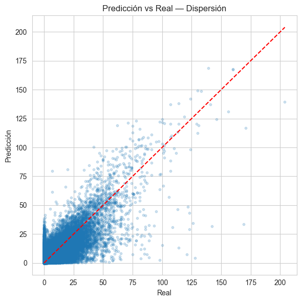

# M5 Forecasting — Retail Demand (Walmart)

**Autores:**  
Diego Melián, Carlos Crisosto, Mauricio Pizarro, Camilo Mesías, Nolberto Rivera  
**Afiliación:** Universidad Técnica Federico Santa María

Sistema de pronóstico de demanda diaria para 30.490 series temporales del desafío **M5 Forecasting (Walmart)**.  
El objetivo es predecir **28 días hacia adelante** a nivel de producto–tienda–estado, manteniendo eficiencia computacional y buena capacidad de generalización.

---

## Objetivo del Proyecto

Construir un modelo capaz de:

- Predecir ventas diarias para un horizonte de **28 días**
- Manejar **alta intermitencia** (≈68% días sin ventas)
- Trabajar con **series jerárquicas** (estado → tienda → departamento → producto)
- Operar con eficiencia sobre más de **45 millones de filas** tras el preprocesamiento

---

## Metodología

### **1. Exploración de Datos (EDA)**
- Análisis de esparsidad por categoría/tienda/estado  
- Estacionalidad semanal y mensual  
- Detección de **rupturas estructurales** con `ruptures`  
- Correlaciones con precio, SNAP y eventos  

### **2. Ingeniería de Características**
- `lag_28`  
- `rolling_mean_7`, `rolling_mean_28`  
- Variables temporales: día, mes, año, día de la semana  
- Unificación SNAP por estado  
- Precios semanales usando `wm_yr_wk`  
- Label Encoding para variables categóricas  
- Optimización de memoria (`int16`, `float16`, categorías)

### **3. Validación**
Validación temporal tipo **Walk-Forward**, con 3 splits consecutivos.  
Horizonte: **28 días** por split.

### **4. Modelos Evaluados**
- Naive  
- Seasonal Naive (7 días)  
- Regresión Lineal  
- **LightGBM (modelo principal)**  
- SARIMA (serie total agregada)  
- Prophet (serie total agregada)

---

## Resultados

| Modelo | Split 1 | Split 2 | Split 3 |
|--------|--------|--------|--------|
| Naive | 3.13 | 3.14 | 3.30 |
| SNaive | 3.67 | 3.63 | 3.60 |
| Regresión Lineal | 2.45 | 2.35 | 2.24 |
| **LightGBM** | **2.75** | **2.20** | **2.10** |

### **Conclusión**
**LightGBM** logra el mejor equilibrio entre precisión y tiempo de entrenamiento, mejorando significativamente el baseline.

---

## Visualizaciones

### **Predicción vs Real (dispersión)**


### **Importancia de Variables (LightGBM)**


---

## Ejecución del Proyecto

### Requerimientos
- Python 3.10+
- pip
- Librerías principales:
  - pandas
  - numpy
  - lightgbm
  - scikit-learn
  - ruptures
  - prophet
  - statsmodels
  - matplotlib / seaborn

Instalar dependencias:

```bash
pip install -r requirements.txt
```

---

## Informe Final del Proyecto

El informe completo, con toda la metodología, resultados y conclusiones, estará disponible en el siguiente enlace:

**[Acceder al Informe Final](/Notebook_M5_Forecasting.ipynb)**

---

## Descarga de la Base de Datos (Kaggle)

Los datos utilizados en este proyecto provienen de la competencia  
**M5 Forecasting — Accuracy** disponible en Kaggle.

Para descargar el dataset:

1. Crear una cuenta en Kaggle (si no tienes una).  
2. Acceder a la competencia en el siguiente enlace:  
   https://www.kaggle.com/competitions/m5-forecasting-accuracy/
3. Ir a la pestaña **"Data"**.
4. Descargar todos los archivos `.csv` del dataset.
5. Colocar los archivos dentro del directorio local:

